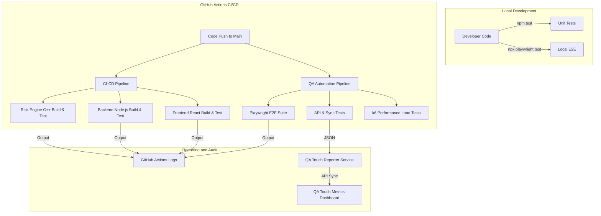

# ZeroVault Testing and Quality Assurance Documentation

This document provides a technical overview of the testing infrastructure, Quality Assurance (QA) methodologies, and Continuous Integration (CI) workflows for the ZeroVault platform.

## 1. Testing Infrastructure Overview

The ZeroVault testing environment is structured to validate security, performance, and functional integrity through automated pipelines.



## 2. Local Execution Procedures

### 2.1 Backend and Risk Engine
Validates the C++ native addon and the Node.js API server.
```bash
cd App/secure_password_demo/server
npm install
npm test
```

### 2.2 End-to-End (E2E) Automation
Simulates comprehensive user journeys using the Playwright framework.
```bash
cd App/secure_password_demo/e2e
npm install
npx playwright install
npx playwright test
```

### 2.3 Performance Stress Testing
Evaluates system throughput and latency using k6.
```bash
cd App/secure_password_demo/performance
k6 run load-test.js
```

## 3. Automation Strategy

The project utilizes two specialized GitHub Actions configurations to manage the security and stability lifecycle:

1.  **ZeroVault Full-Stack CI/CD (ci-cd.yml)**:
    - **Risk Engine Core**: Compilation and unit testing of C11 native components.
    - **Backend Server**: Integration testing of Node.js services and dependency verification.
    - **Frontend Client**: Build verification and Vitest execution for React components.

2.  **QA Automation Pipeline (qa-pipeline.yml)**:
    - **API and Sync**: Validation of multi-device synchronization and data integrity.
    - **Playwright E2E Suite**: Verification of critical UI paths, including vault creation and credential management.
    - **k6 Performance**: Quantitative benchmarking against performance KPIs.
    - **QA Touch Synchronization**: Automated data transmission to the QA Touch dashboard for engineering oversight.

## 4. Quality Assurance Principles

- **Security Isolation**: Automated verification that master passwords remain strictly client-side.
- **Cross-Browser Integrity**: Systematic testing across Chromium, Firefox, and WebKit engines.
- **Continuous Audit**: Real-time visibility into the security posture of every commit via GitHub Checks and external reporting services.


