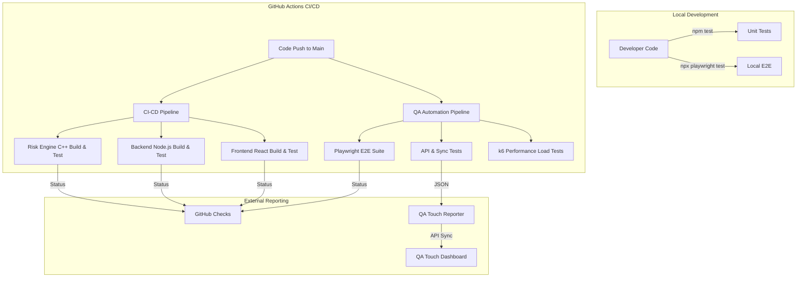

# 🧪 ZeroVault Testing & Quality Assurance Guide

This document provides a comprehensive overview of the testing infrastructure, Quality Assurance (QA) processes, and the CI/CD pipeline for the ZeroVault Secure Password Manager.

---

## 🏗 Testing Pipeline Architecture

The following diagram illustrates how our automated testing flows from local development to centralized Quality Assurance reporting.



---

## 🚀 How to Run Tests Locally

### 1. Backend Service (Unit & Integration)
Focuses on the Risk Engine (C++ boundary) and the Node.js API logic.
```bash
cd App/secure_password_demo/server
npm install
npm test
```

### 2. End-to-End (E2E) Testing
Uses Playwright to simulate real user interactions across multiple browsers.
```bash
cd App/secure_password_demo/e2e
npm install
npx playwright install
npx playwright test
```

### 3. Performance & Load Testing
Uses k6 to ensure the system can handle concurrent users and high-stress scenarios.
```bash
cd App/secure_password_demo/performance
k6 run load-test.js
```

---

## 🛠 CI/CD Pipeline Explanation

Our Automation Strategy is split into two specialized pipelines:

1.  **ZeroVault Full-Stack CI/CD (`ci-cd.yml`)**:
    - **Purpose**: Essential verification for code health.
    - **Stages**:
        - **Risk Engine Core**: Compiles C11 code and runs native unit tests.
        - **Backend Server**: Validates Node.js logic and dependencies.
        - **Frontend Client**: Runs Vitest suite and generates production production builds.

2.  **QA Automation Pipeline (`qa-pipeline.yml`)**:
    - **Purpose**: High-level behavioral and performance validation.
    - **Stages**:
        - **API & Sync**: Testing data integrity and multi-device synchronization.
        - **Playwright E2E**: Validating critical user journeys (Vault creation, credential management).
        - **k6 Performance**: Benchmarking system latency and throughput.
        - **QA Touch Sync**: Automatically uploads all test results to the centralized dashboard for engineering oversight.

---

## 💎 Quality Assurance Philosophy

- **Zero-Knowledge First**: Tests verify that master passwords never leave the client and that data is strictly decrypted locally.
- **Cross-Platform Consistency**: Automated E2E runs across Chromium, Firefox, and WebKit to ensure a uniform user experience.
- **Transparency**: Every build provides a detailed audit trail of security and functional health via GitHub Checks and QA Touch.
