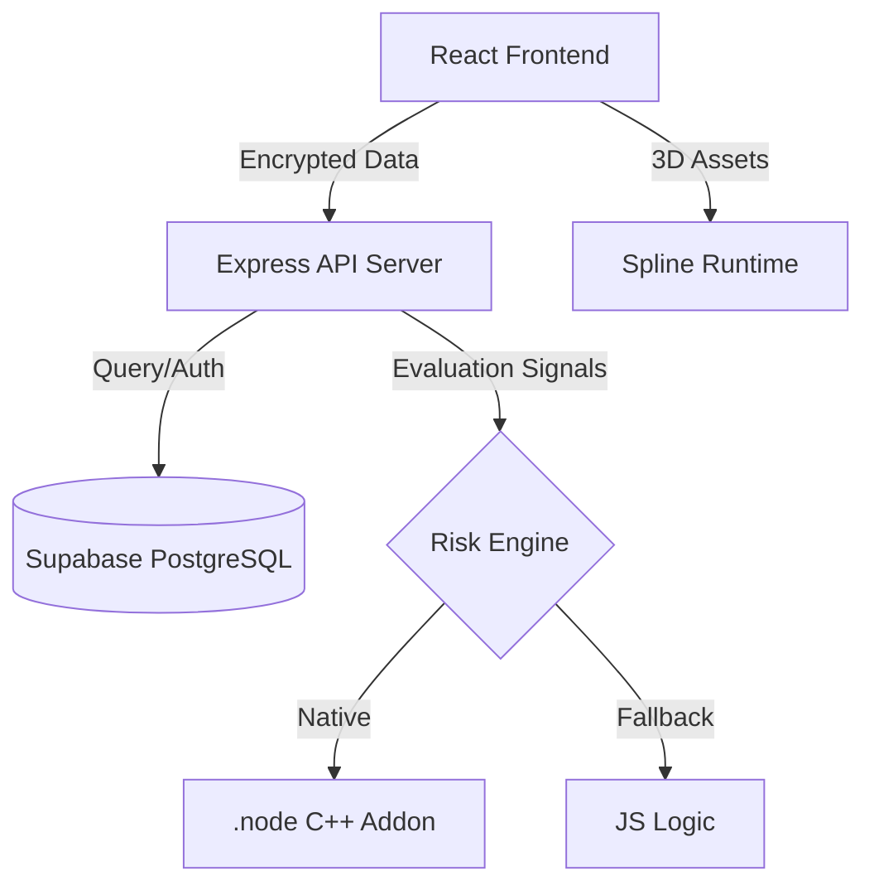
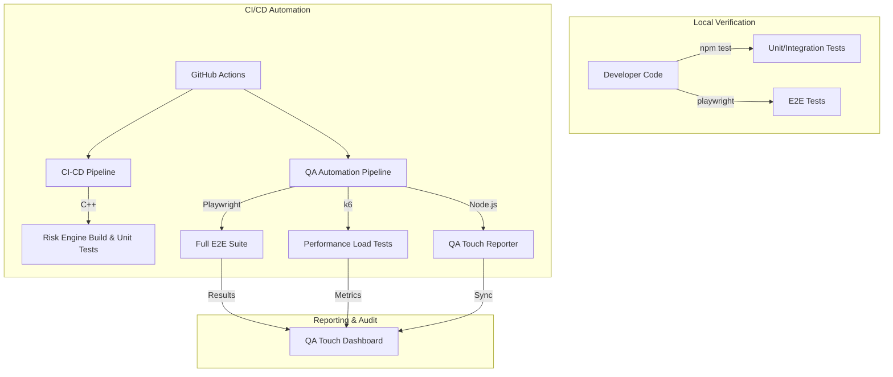

# Zero Vault 🛡️


**Zero Vault** is a state-of-the-art, secure password management platform built with a **Zero-Knowledge Architecture**. It ensures that your sensitive data is encrypted client-side using industry-standard AES-GCM encryption before ever leaving your device. 

The platform features a native C++ **Risk Engine** for high-performance security evaluations and a robust synchronization system powered by **Supabase**.

---

## 🌟 Key Features

- **🔒 Zero-Knowledge Security**: AES-GCM (256-bit) encryption happens entirely in your browser. Your master password and raw data are never transmitted.
- **🛡️ Adaptive Risk Engine**: Integrated C++ native addon for real-time risk assessment (Secure Boot verification, Device Trust, and Brute-force detection).
- **⚡ Automated JS Fallback**: Intelligent build system that automatically switches to a JavaScript security engine if native compilation is unavailable.
- **☁️ Supabase Integration**: Reliable cloud synchronization and storage using PostgreSQL and Supabase Auth.
- **📱 Responsive UI**: A premium, dark-mode first interface built with React 19, Framer Motion, and Tailwind CSS.
- **✨ 3D Visuals**: Immersive experience with Spline 3D integrations.

---

## 🏗️ Technical Architecture

Zero Vault uses a decoupled architecture to ensure maximum security and performance.

### Security Model
1. **Client-Side Encryption**: Derived keys (PBKDF2) never leave the browser.
2. **Native Risk Engine**: A low-level C module handles sensitive security decisions.
3. **Database Security**: Row Level Security (RLS) policies in Supabase prevent unauthorized data access.

### System Diagram


---

## 💻 Tech Stack

- **Frontend**: React 19, TypeScript, Vite, Tailwind CSS, Framer Motion, Spline.
- **Backend**: Node.js, Express, TypeScript.
- **Database/Auth**: Supabase (PostgreSQL).
- **Native**: C++, Node-API (node-gyp).

---

## 🚀 Getting Started

### Prerequisites
- **Node.js**: `v20.19+` or `v22.x` (Required for Vite & Spline compatibility)
- **NPM**: `v10.x+`
- **Compiler**: Visual Studio Build Tools (C++) *Optional* — only if you want to build the native addon.

### Installation

1. **Clone & Navigate**
   ```bash
   cd Secure_Password_Manager_Extension/App/secure_password_demo
   ```

2. **Install Client Dependencies**
   ```bash
   cd client
   npm install --legacy-peer-deps
   ```

3. **Install Server Dependencies**
   ```bash
   cd ../server
   npm install --legacy-peer-deps
   ```

### Configuration
Ensure you have `.env` files in both `client/` and `server/` with the following keys:
- `VITE_SUPABASE_URL`
- `VITE_SUPABASE_ANON_KEY`
- `JWT_SECRET`
- `SUPABASE_SERVICE_ROLE_KEY`

---

## 🛠️ Running the Application

### 1. Start the Backend
```bash
cd server
npm run dev
```
*Note: You may see a "Native Risk Engine not found" message. This is expected as the system automatically defaults to the JavaScript fallback.*

### 2. Start the Frontend
```bash
cd client
npm run dev
```
Open `http://localhost:5173` in your browser.

---

## 🧪 Quality Assurance & Testing

Zero Vault maintains a high-security standard through a multi-layered automated testing and Quality Assurance (QA) strategy.

### 🏗️ Testing Pipeline Architecture

Our QA engineering workflow ensures that every security claim is validated automatically before code reaches production.



### 🎯 QA Strategy Overview

- **Security Engineering**: Tests verify zero-knowledge integrity, ensuring master passwords never leave the client.
- **Cross-Platform QA**: Automated Playwright runs across Chromium, Firefox, and WebKit for UI consistency.
- **Performance Benchmarking**: Integrated k6 load testing ensures system latency remains <800ms for large datasets.
- **Centralized Reporting**: All test results are automatically synchronized with the **QA Touch** dashboard for real-time visibility.

### 🏃 How to Run Tests

For a deep dive into our testing procedures, see the [Detailed Testing Guide](App/secure_password_demo/TESTING.md).

- **Backend Logic (Jest)**: `cd App/secure_password_demo/server && npm test`
- **Native Risk Engine**: `cd App/secure_password_demo/server/src/native/risk-engine && ./run_all_unit_tests.sh`
- **Playwright E2E**: `cd App/secure_password_demo/e2e && npx playwright test`
- **k6 Performance**: `cd App/secure_password_demo/performance && k6 run load-test.js`

---

## 📄 License
Distributed under the MIT License. See `LICENSE` for more information.

## 🤝 Contributing
Zero Vault is a research-focused project. Pull requests are welcome for security enhancements and performance optimizations.


